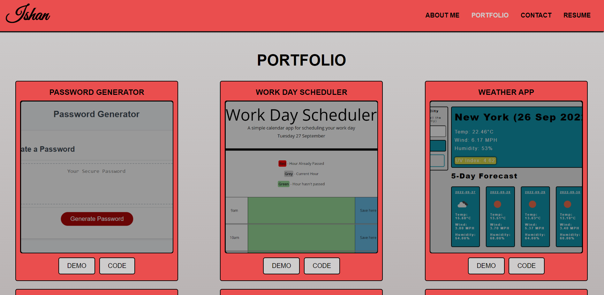
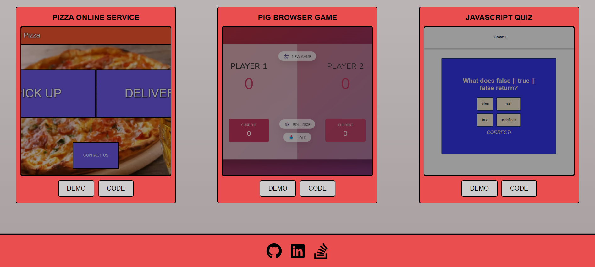
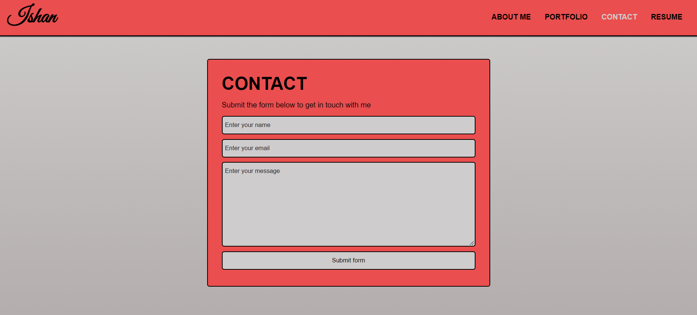
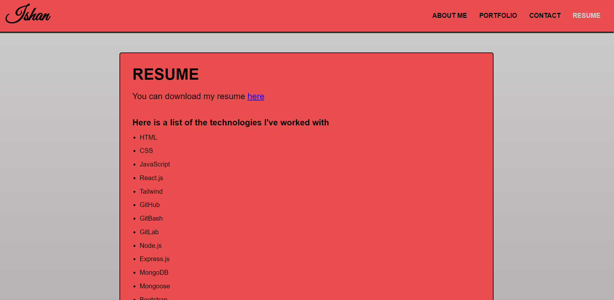

# React Portfolio Challenge

## Description
This application is a single page portfolio for potential employers to gauge React skills as well as get access to personal projects and relevant information about me. 

The header section is present in all versions of the single page portfolio, always remaining at the top. Likewise, the footer always remains at the bottom. 

The header has my name on the left-hand side which is clickable and takes the user to the default 'About Me' section, the right-hand side consists of links to different sections that are dynamically rendered for the user. As a user clicks one of these links, the section displayed to the user changes and the colour of the link that was clicked also changes.

The footer contains three clickable icons, one takes the user to my GitHub profile, an another takes the user to my LinkedIn profile, and the the other takes the user to my StackOverflow profile.

In the 'About Me' section, a short bio and recent photo of me is shown. 

In the 'Portfolio' section, six projects of mine are shown. Each project has a title and an image. Each project also has clickable links to a demo of the project as well as the GitHub code.

In the 'Contact' section, there is a contact form that the user can fill in. The form asks for a name, email and message. If the form is submitted and the name input has not been filled in, a warning will be shown to the user, and once the user types something into the name input, that warning will disappear. The same thing is true for the message input and email field. Furthermore, for the email field, if what is written in the input by the user is not in a standard email format, another warning will be shown. When the user clicks the submit button and all inputs are in order, a modal window will be shown to indicate the form has been submitted.

In the 'Resume' section, there is a link that will allow the user to download my resume as a PDF, and there is also a list of technologies I've worked with in the past.

## Screenshot

## Link to Deployed application
https://ishan-wijesingha99.github.io/React-Portfolio-Challenge/

## Minor Problem with the Assessment Criteria
On the 'Contact' page, I was unable to get the form input error messages to appear when the user clicks off the inputs. I was able to get the error messages to appear once the user attempted to submit the form, and also the error messages would automatically leave once the input values were set right. The same general function was achieved but not exactly as specified in the assessment criteria.
